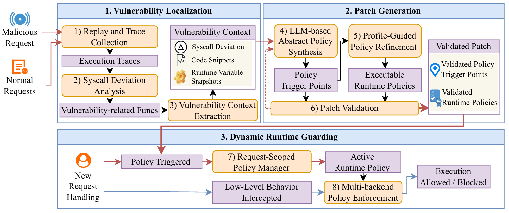

# KINTSUGI: Empowering LLMs to Mitigate Web Vulnerabilities via Runtime Policy Injection

> An automated vulnerability mitigation system that leverages LLMs and differential syscall analysis to generate request-scoped runtime security policies.

## Overview

The critical window between vulnerability detection and patching leaves web applications exposed to repeated exploits. Traditional approaches fail to provide effective temporary mitigation.

**KINTSUGI** introduces a novel paradigm: **request-scoped runtime policy injection**.

1. **Localizes vulnerabilities** using differential syscall analysis (86.5% context reduction)
2. **Identifies semantic boundaries** with LLM guidance to pinpoint attack trigger points
3. **Derives deterministic policies** from historical normal traffic profiles
4. **Enforces surgical isolation** via eBPF (syscalls) and cgroups (network) at the kernel level
5. **Activates policies only during vulnerable request execution**, ensuring zero impact on concurrent traffic

This approach provides **automated, temporary mitigation in minutes** while preserving original application functionality.

## Contributions

**1. Novel Mitigation Paradigm**
Shifts from risky code rewriting to **request-scoped runtime policy injection**, leveraging LLMs to surgically constrain malicious behaviors while preserving original business logic.

**2. Multi-Stage Framework**
Integrates (1) **differential syscall analysis** to pinpoint vulnerability-related functions, (2) **hybrid policy generator** combining LLM-based delimitation with profile-guided derivation, and (3) **multi-backend runtime engine** (eBPF + cgroups) for fine-grained request-level enforcement.

**3. Real-World Evaluation**
Neutralizes **27 real-world vulnerabilities** with **102-second median response time** and only **2.21% throughput impact** on concurrent legitimate traffic.

## System Architecture



### 12-Stage Pipeline

KINTSUGI operates through a automated pipeline that collects both normal and malicious traffic for differential analysis. The workflow consists of three phases: **differential analysis** (stages 2-7) pinpoints vulnerability-related functions by comparing normal vs. malicious behavior, **LLM repair generation** (stage 8) inserts policy enforcement hooks with placeholders, and **deterministic whitelist derivation** (stage 9) populates least-privilege rules from normal traffic profiles.

**Detailed Stages:**
```
 1. up          - Start containers (docker compose up)
 2. build       - Build and install plugins (stack_tracer, syscall_filter, net_filter)
 3. collect     - Collect normal/malicious traffic (sysdig + locust)
 4. parse       - Convert sysdig logs to JSON
 5. segment     - Segment by request units
 6. callstack   - Extract call stacks
 7. extract     - Extract source code from container
 8. detect      - Anomaly detection (Jaccard, n-gram, network metrics)
 9. repair      - Generate repair code (insert $WHITELIST$ placeholder)
 10. whitelist   - Static analysis to populate whitelist
 11.  validate    - Restart container and validate repair
 12.  down        - Stop containers (docker compose down)
```

## Evaluation Results

### Benchmark Overview

KINTSUGI was evaluated on **27 real-world vulnerabilities** across three major web development stacks, covering **8 out of 10 OWASP Top 10 (2025)** threat categories:

| Stack | CVEs | Representative Applications |
|-------|------|----------------------------|
| **PHP** | 10 | Drupal, phpMyAdmin, Joomla, Cacti, Craft CMS, VuFind, Flarum, GitList, CMSMS |
| **Python** | 10 | pgAdmin, NLTK, Plone CMS, Graphite, Superset, Label Studio, MobSF, Pillow |
| **Java** | 7 | Spring Framework, Fastjson, Apache Commons, Apache OFBiz |

**Vulnerability Types:** Deserialization (A08), RCE/Injection (A05), SSRF (A01), Access Control (A02), Broken Authentication (A07), Security Misconfiguration (A06), Supply Chain (A03), Info Leak (A10).

**Official Patch Patterns:** Type A (Sanitization), Type B (Access Control), Type C (Functional Deprecation), Type D (Structural Refactoring), Type E (Dependency Update). KINTSUGI successfully mitigates all types, including challenging Type D/E cases (e.g., replacing `pickle` with `json`, upgrading third-party libraries).

### Performance Metrics

| Metric | Result |
|--------|--------|
| **Success Rate** | 27/27 CVEs (100%) |
| **Response Time (median)** | 102 seconds |
| **Response Time (average)** | 7.6 minutes |
| **Context Reduction** | 86.5% (via differential analysis) |
| **Performance Impact (concurrent traffic)** | 2.21% RPS drop |
| **Performance Impact (vulnerable API)** | 29.5% latency increase (peak) |

---

## Installation

### Prerequisites

```bash
# System requirements
- Linux kernel ≥ 5.8 (for eBPF support)
- Docker & Docker Compose
- Python 3.9+
- sysdig
- Sudo privileges (for eBPF and cgroup setup)
```

### System Setup

```bash
# 1. Clone repository
git clone https://github.com/YOUR_ORG/kintsugi.git
cd kintsugi

# 2. Install Python dependencies
pip install -r requirements.txt

# 3. Install sysdig (if not already installed)
# Ubuntu/Debian:
curl -fsSL https://s3.amazonaws.com/download.draios.com/DRAIOS-GPG-KEY.public | sudo apt-key add -
sudo curl -fsSLo /etc/apt/sources.list.d/draios.list https://s3.amazonaws.com/download.draios.com/stable/deb/draios.list
sudo apt-get update
sudo apt-get install -y sysdig

# 3. Configure LLM API key
export OPENAI_API_KEY="your-key-here"
# Or use Azure OpenAI:
# export AZURE_OPENAI_ENDPOINT="https://..."
# export AZURE_OPENAI_KEY="..."
```

### Language-Specific Plugins

KINTSUGI supports multiple languages through custom instrumentation plugins:

- **PHP 5/7/8**: Zend extension for function-level instrumentation ([stack_tracer/php*](stack_tracer))
- **Python**: `sys.settrace()`-based tracer ([stack_tracer/python](stack_tracer/python))
- **Java**: JVMTI agent (maintained by collaborators, not included in this repository)

> **Note:** Java support is demonstrated in the research paper with 7 CVEs. The Java stack tracer and test cases are maintained in a separate repository by our collaborators. This repository focuses on PHP and Python implementations.

---

## Usage

### Quick Start: Running a Full Pipeline

```bash
# Example: Mitigate CVE-2018-7600 (Drupal RCE)
python main.py --cve CVE-2018-7600 --stage 0-11

# This will:
# - Start vulnerable Drupal container
# - Collect normal and malicious traffic
# - Localize the vulnerability via differential analysis
# - Generate repair policy using GPT-4
# - Validate the fix blocks attacks while preserving functionality
```

### Step-by-Step Workflow

```bash
# 1. List available CVEs
python main.py --list

# 2. Start environment
python main.py --cve CVE-2018-7600 --stage 0

# 3. Collect traffic (60s normal, 20s malicious)
python main.py --cve CVE-2018-7600 --stage 2 \
  --normal-time 60 --malicious-time 20

# 4. Run detection pipeline (parse → segment → callstack → extract → detect)
python main.py --cve CVE-2018-7600 --stage 3-7

# 5. Generate repair with LLM
python main.py --cve CVE-2018-7600 --stage 8 \
  --repair-mode filter --whitelist-mode static

# 6. Populate whitelist via static analysis
python main.py --cve CVE-2018-7600 --stage 9

# 7. Validate repair (restarts container, tests normal + malicious traffic)
python main.py --cve CVE-2018-7600 --stage 10

# 8. Cleanup
python main.py --cve CVE-2018-7600 --stage 11
```

### Advanced Options

| Flag | Description | Example |
|------|-------------|---------|
| `--algo` | Detection algorithms | `--algo jaccard ngram` |
| `--threshold` | Anomaly score threshold | `--threshold 0.5` |
| `--repair-mode` | Repair strategy | `filter`, `direct`, `direct_localization` |
| `--whitelist-mode` | Whitelist generation | `static` (default), `llm` |
| `--max-repairs` | Max repair attempts | `--max-repairs 3` |
| `--validate-mode` | Validation scope | `normal`, `abnormal`, `all` |

**Supported Detection Algorithms** (Stage 7):
- `jaccard`: Syscall set similarity
- `ngram`: Syscall sequence patterns (n=3)
- `n_ips`, `n_ports`: Network behavior metrics
- `file`, `proc`: Resource access patterns
- `internal`: Internal function call patterns

---

## CVE Test Cases

### Supported Vulnerabilities

#### PHP (10 CVEs)

| CVE ID | Application | Type | Description |
|--------|-------------|------|-------------|
| [CVE-2018-7600](cves/php/CVE-2018-7600) | Drupal 8.5.0 | RCE | Drupalgeddon 2 - Form API `#post_render` exploitation |
| [CVE-2016-5734](cves/php/CVE-2016-5734) | phpMyAdmin | RCE | `preg_replace` /e modifier with null byte truncation |
| [CVE-2022-46169](cves/php/CVE-2022-46169) | Cacti | Command Injection | Unsanitized `poller_id` parameter |
| [CVE-2024-25737](cves/php/CVE-2024-25737) | VuFind | SSRF | Cover proxy parameter allows internal network access |
| [CVE-2015-8562](cves/php/CVE-2015-8562) | Joomla | Deserialization | PHP object injection via unsafe `unserialize()` |
| [CVE-2018-1000533](cves/php/CVE-2018-1000533) | GitList | RCE | Source code viewing vulnerability |
| [CVE-2021-26120](cves/php/CVE-2021-26120) | CMS Made Simple | SSTI | Smarty template injection via file upload |
| [CVE-2023-40033](cves/php/CVE-2023-40033) | Flarum | SSRF | Avatar upload triggers intervention/image SSRF |
| [CVE-2023-41892](cves/php/CVE-2023-41892) | Craft CMS | RCE | Unsafe object instantiation in template system |
| [CVE-2024-25738](cves/php/CVE-2024-25738) | VuFind | SSRF | Upgrade module FTP/protocol handler |

#### Python (10 CVEs)

| CVE ID | Application | Type | Description |
|--------|-------------|------|-------------|
| [CVE-2022-4223](cves/python/CVE-2022-4223) | pgAdmin 4.25 | Command Injection | `validate_binary_path` doesn't sanitize `utility_path` |
| [CVE-2024-39705](cves/python/CVE-2024-39705) | NLTK | Deserialization | Unsafe `pickle.loads()` with `__reduce__` gadget |
| [CVE-2021-33926](cves/python/CVE-2021-33926) | Plone CMS | Blind SSRF | RSS Feed Portlet triggers internal requests |
| [CVE-2017-18638](cves/python/CVE-2017-18638) | Graphite | SSRF | Graphite framework internal access |
| [CVE-2018-16509](cves/python/CVE-2018-16509) | Unknown | Code Execution | Requires investigation |
| [CVE-2023-37941](cves/python/CVE-2023-37941) | Apache Superset | RCE | Pickle deserialization in permalink |
| [CVE-2023-47116](cves/python/CVE-2023-47116) | Label Studio | SSRF | DNS rebinding attack |
| [CVE-2023-5002](cves/python/CVE-2023-5002) | pgAdmin 7.6 | Command Injection | Similar to CVE-2022-4223, updated version |
| [CVE-2025-2945](cves/python/CVE-2025-2945) | pgAdmin | Code Injection | `eval()` usage in configuration |
| [CVE-2025-31116](cves/python/CVE-2025-31116) | MobSF | SSRF | DNS rebinding in mobile security scanner |

#### Java

> **Note:** Java support (7 CVEs including CVE-2018-1273, CVE-2022-22947, CVE-2022-25845, etc.) is demonstrated in the research paper. The Java JVMTI stack tracer and test cases are maintained by our collaborators in a separate repository.

### Adding Custom CVEs

To add a new CVE to the test suite:

1. **Create directory structure**:
   ```bash
   mkdir -p cves/{language}/{CVE-ID}/env
   cd cves/{language}/{CVE-ID}
   ```

2. **Add Docker environment**:
   - Create `env/docker-compose.yml` for the vulnerable application
   - Create `env/Dockerfile` if custom image needed

3. **Create traffic generators**:
   - `normal.py` - Locust script for legitimate user behavior
   - `malicious.py` - Locust script with exploit payloads

4. **Register in configuration**:
   ```yaml
   # config/cves.yaml
   CVE-XXXX-XXXXX:
     language: php  # or python
     version: 7
     container: cve-xxxx-xxxxx-env
     port: 8080
     use_whitelist: true
     manual_install: false
     filter_irrelevant: true
   ```

5. **Run the pipeline**:
   ```bash
   python main.py --cve CVE-XXXX-XXXXX --stage 0-11
   ```

---

## How It Works: Technical Deep Dive

### Differential Syscall Analysis

**Core Innovation:** Instead of analyzing thousands of functions, KINTSUGI compares syscall traces from malicious vs. normal requests to isolate vulnerability-triggering functions.

**Process:**
1. Collect syscall traces from normal and malicious requests via sysdig
2. Use similarity algorithms to identify behavioral anomalies:
   - **Jaccard similarity**: Syscall set overlap
   - **N-gram analysis**: Syscall sequence patterns (n=3)
   - **Network metrics**: Unique IPs and ports accessed
   - **File/Process metrics**: Resource access patterns
3. Localize to specific functions where behavior "mutates"

**Result:** Median reduction from **212.8 functions → 1.9 functions** (86.5% context reduction: 42,886 tokens → 783 tokens).

**Example** (CVE-2021-26120):
```
Normal:  loadCompiledTemplate → openat, read
Malicious: loadCompiledTemplate → openat, read, clone, execve

Detection: execve syscall anomaly → function localized
```

### LLM-Based Repair Generation

**Hybrid Approach:** LLM identifies semantic boundaries; deterministic analysis fills the details.

**Stage 8 Workflow:**
1. **Input**: Localized vulnerable functions + differential syscall patterns
2. **LLM Task**: Identify attack entry point and insert filter markers (NOT generate security rules)
3. **Output**: Modified code with `$WHITELIST$` placeholder

**Example Repair** (simplified SSRF mitigation):

```php
// Before (vulnerable)
function handle_upload($url) {
    $data = file_get_contents($url);  // SSRF vulnerability
    return $data;
}

// After (KINTSUGI repair)
function handle_upload($url) {
    require_once 'net_filter.php';
    net_filter_begin($WHITELIST$);  // Placeholder filled in Stage 9
    try {
        $data = file_get_contents($url);
        return $data;
    } finally {
        net_filter_end();
    }
}
```

### Profile-Guided Whitelist Derivation

**Stage 9 Static Analysis:**
1. Extract all syscalls from normal traffic callstacks within the protected code block
2. Aggregate by function signature to compute union of legitimate operations
3. Fill `$WHITELIST$` with deterministic allowlist (no LLM hallucination)

**For syscall filtering:**
```python
# Derived from normal traffic analysis
WHITELIST = ['openat', 'read', 'write', 'close']  # File I/O only, no execve
```

**For network filtering:**
```python
# Derived from normal traffic IP analysis
WHITELIST = {
    'mode': 'internal_only',  # Block external IPs
    'allowed_ips': ['10.0.0.0/8', '172.16.0.0/12']  # Private ranges
}
```

### Runtime Enforcement

#### Syscall Filter (eBPF)

**Architecture:**
- eBPF kprobe attached to syscall entry points
- Thread-level granularity via `pid_tid` tracking
- Whitelist stored in BPF hash map
- Zero overhead when not activated

**Enforcement Flow:**
```
Request → Stack Tracer → Repair Code
                              ↓
                      Filter Activated
                              ↓
              prctl(999, policy_id)  # User-space signal
                              ↓
              eBPF Kprobe Intercepts Syscall
                              ↓
              Check Thread ID in Map
                              ↓
              Syscall in Whitelist?
                 ├── Yes → Allow
                 └── No  → Block (return -EPERM)
```

**Path-Aware Filtering:**
- Pre-compute FNV-1a hashes of allowed file path prefixes
- Kernel reads only first L_max bytes from user-space
- Single-pass hash matching (bypasses eBPF verifier limitations)

#### Network Filter (cgroups + iptables)

**Architecture:**
- Thread migrated to restricted cgroup on filter activation
- cgroup assigned unique ClassID for packet tagging
- iptables rules match ClassID to enforce network policies

**Enforcement Flow:**
```
Request → Stack Tracer → Repair Code
                              ↓
                      Filter Activated
                              ↓
          Write TID to /sys/fs/cgroup/.../cgroup.procs
                              ↓
              Kernel Tags Packets with ClassID
                              ↓
         iptables Matches ClassID Against Rules
                 ├── Internal IP → Block (SSRF prevention)
                 └── External IP → Allow
                              ▼
                      Filter Deactivated on Exit
```

**Hierarchical Inheritance:**
Child processes/threads automatically inherit ClassID, preventing reverse shell bypasses.

---

## Configuration

### CVE Registry Format

Each CVE is configured in [`config/cves.yaml`](config/cves.yaml):

```yaml
cves:
  CVE-2018-7600:
    language: php
    version: 7
    container: cve-2018-7600-env
    port: 8080
    use_whitelist: true          # Enable stack-based filtering during detection
    manual_install: true         # Requires interactive setup
    filter_irrelevant: true      # Enable differential filtering
    repair_method: auto          # auto | syscall | network
```

**Key Fields:**
- `language`: `php`, `python`
- `use_whitelist`: Enable whitelist-based call stack filtering during Stage 5
- `manual_install`: Requires manual setup steps (e.g., Drupal installation wizard)
- `repair_method`:
  - `auto` - LLM decides between syscall/network filtering
  - `syscall` - Force syscall-based repair
  - `network` - Force network-based repair

### LLM Configuration

Set API credentials via environment variables:

```bash
# OpenAI API (default)
export OPENAI_API_KEY="<your-api-key>"
export OPENAI_MODEL="gpt-4"  # or gpt-4-turbo

# Azure OpenAI (alternative)
export AZURE_OPENAI_ENDPOINT="https://your-instance.openai.azure.com/"
export AZURE_OPENAI_KEY="..."
export AZURE_OPENAI_DEPLOYMENT="gpt-4"
```

**Cost Estimates:**
- Median token usage: ~15K tokens per CVE (after 86.5% context reduction)
- Cost: ~$0.30 per CVE with GPT-4 pricing (as of 2025)
